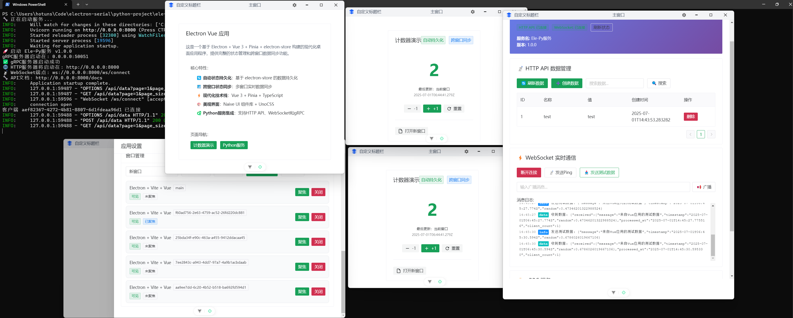

# Electron Serial - Electron + Python 集成项目

基于 Electron + Vue + Python 的桌面应用程序，集成 FastAPI 后端服务支持。



## ✨ 技术栈

### 前端技术
- Electron v29.4.6
- Vue 3 v3.4.21 + TypeScript v5.8.3
- Vite v5.4.19
- Naive UI v2.42.0
- UnoCSS v66.3.2

### 后端技术
- Python 3.13+
- FastAPI (HTTP API + WebSocket)
- uvicorn (ASGI 服务器)
- uv (Python包管理器)

## 📁 项目结构

```
electron-serial/
├── electron/                    # Electron主进程和预加载脚本
│   ├── main/                   # 主进程代码
│   │   ├── handlers/           # IPC处理器
│   │   ├── services/           # Python服务集成
│   │   └── window/             # 窗口管理
│   └── preload/                # 预加载脚本
├── src/                        # Vue渲染进程
│   ├── components/             # Vue组件
│   ├── views/                  # 页面组件
│   ├── hooks/                  # 组合式API
│   ├── stores/                 # Pinia状态管理
│   └── utils/                  # 工具函数
│       └── pythonApi.ts        # Python API封装
└── python-project/             # Python后端服务
    └── ele-py/                 # FastAPI服务
        ├── main.py             # 主入口文件
        ├── config.py           # 配置文件
        ├── models.py           # 数据模型
        └── api/                # HTTP和WebSocket API
            ├── http_routes.py  # REST API路由
            └── websocket_handler.py # WebSocket处理
```

## 🛠 开发环境

### 前置要求
- Node.js 18+
- Python 3.13+
- uv (Python包管理器)

### 安装和启动

#### 1. 克隆项目
```bash
git clone <repository-url>
cd electron-serial
```

#### 2. 安装依赖
```bash
# 安装Node.js依赖
npm install

# 安装Python依赖
cd python-project/ele-py
uv sync
cd ../..
```

#### 3. 启动开发环境
```bash
# 方式一：分别启动（推荐用于开发调试）

# 终端1: 启动Python服务
cd python-project/ele-py
uv run python main.py

# 终端2: 启动Electron应用
npm run dev

# 方式二：使用项目内置的Python服务启动
npm run dev  # Electron会自动管理Python服务
```

## 🐍 Python服务功能

Python服务基于FastAPI，提供三种通信方式：

### 1. HTTP API (端口: 8000)
- ✅ RESTful API，支持数据CRUD操作
- 📊 健康检查和状态监控
- 📚 自动API文档：http://localhost:8000/docs
- 🔍 交互式API文档：http://localhost:8000/redoc

### 2. WebSocket (端口: 8000)
- 🔄 实时双向通信
- 📡 消息广播和心跳保活
- 🔗 连接地址：ws://localhost:8000/ws/connect

### 3. Electron集成
- 🚀 自动启动和停止Python服务
- 📞 IPC通信桥接
- 🔧 服务状态监控

## 🖥 Electron应用功能

### 页面结构
- **首页** (`/`): 应用介绍和导航
- **计数器** (`/count`): Pinia状态管理演示
- **Python服务** (`/python-service`): Python服务集成页面

### Python服务页面功能

#### HTTP API面板
- ✅ 服务状态检测
- 📋 数据列表查看和管理
- ➕ 创建新数据
- 🔍 搜索和分页功能
- 🗑️ 数据删除操作

#### WebSocket面板
- 🔗 连接状态管理
- 📡 Ping/Pong连接测试
- 📤 实时数据发送
- 📢 消息广播功能
- 📝 实时通信日志

### 窗口管理功能
- 🪟 多窗口支持
- 🎛️ 自定义标题栏
- 📐 窗口大小和位置记忆
- 🔄 自动更新检测

## 🔧 开发说明

### API调用示例

```typescript
// HTTP API调用
import { pythonApi } from '@/utils/pythonApi'

// 获取数据列表
const response = await pythonApi.getDataList()

// 创建新数据
await pythonApi.createData({ name: 'test', value: 123 })

// WebSocket连接
import { pythonWs } from '@/utils/pythonApi'

// 建立连接
await pythonWs.connect()

// 发送数据
pythonWs.sendData({ message: 'Hello Python!' })

// 监听消息
pythonWs.onMessage((data) => {
  console.log('收到消息:', data)
})
```

### Python服务开发

```python
# 添加新的HTTP路由 (api/http_routes.py)
@router.get("/custom-endpoint")
async def custom_endpoint():
    return {"message": "自定义端点"}

# 添加WebSocket处理 (api/websocket_handler.py)
@websocket.route("/ws/custom")
async def custom_websocket(websocket: WebSocket):
    await websocket.accept()
    # 自定义WebSocket逻辑
```

## 📋 构建和发布

### 开发模式
```bash
npm run dev              # 启动开发环境
npm run dev:electron     # 仅启动Electron（需要手动启动Python）
```

### 构建应用
```bash
# 构建Electron应用
npm run build           # 完整构建并打包
npm run build:dir       # 构建目录版本（不打包）

# 构建Python服务
cd python-project/ele-py
## Python 服务集成

项目集成了 Python 服务，使用 **uv** 运行时方式，支持自动环境管理和依赖安装。

### 特性

- ✅ 使用 uv 进行 Python 包管理和运行
- ✅ 自动虚拟环境创建和管理
- ✅ 自动依赖安装（通过 uv sync）
- ✅ 跨平台支持（Windows、macOS、Linux）
- ✅ 完善的进程生命周期管理

现在需要换一个方式：
在项目中下载一个uv，然后electron可以通过调用uv来运行python代码

参考：https://github.com/Comfy-Org/desktop 的实现方式

## ✨ 最新更新

**已完成从 PyFuze 编译到 uv 运行的迁移！**

### 主要变更

1. **从编译模式改为运行时模式**
   - 移除 PyFuze 编译步骤
   - 集成 uv 可执行文件到项目中
   - Python 代码在运行时通过 uv 执行

2. **自动环境管理**
   - 自动下载对应平台的 uv 可执行文件
   - 自动创建和管理 Python 虚拟环境
   - 使用 `uv sync` 安装依赖（推荐）或回退到传统 pip

3. **新增功能**
   - 虚拟环境健康检查
   - 虚拟环境重建功能
   - 更好的错误处理和日志记录

### 快速开始

```bash
# 1. 安装依赖并设置项目
npm run setup

# 2. 启动开发环境
npm run dev
```

### 技术架构

- **前端**: Vue 3 + TypeScript + Vite
- **桌面**: Electron
- **Python 运行时**: uv (集成到应用中)
- **Python 环境**: 自动管理的虚拟环境
- **Python 版本**: 3.12 (可配置)

### 发布配置
应用的构建配置在 `electron-builder.json5` 中定义，支持：
- Windows (exe, msi)
- macOS (dmg, pkg)  
- Linux (AppImage, deb, rpm)

## 🔍 故障排除

### Python服务连接问题
1. ✅ 确认Python服务正在运行：访问 http://localhost:8000
2. 🔥 检查防火墙设置，确保8000端口未被阻止
3. 🐛 查看浏览器控制台和Electron开发者工具的错误信息
4. 📦 确认Python依赖已正确安装：`uv sync`

### WebSocket连接问题
1. 🔌 检查WebSocket服务状态
2. 🚪 确认没有其他应用占用8000端口
3. 🌐 查看浏览器网络面板的WebSocket连接状态
4. 🔄 尝试重新连接或重启服务

### Electron应用问题
1. 🔄 清理缓存：删除 `node_modules` 后重新 `npm install`
2. 🐛 检查Electron开发者工具的Console和Network面板
3. 📁 确认工作目录正确，在项目根目录运行命令

## 🤝 贡献指南

1. Fork 项目
2. 创建功能分支 (`git checkout -b feature/AmazingFeature`)
3. 提交更改 (`git commit -m 'Add some AmazingFeature'`)
4. 推送到分支 (`git push origin feature/AmazingFeature`)
5. 打开 Pull Request

## 📄 许可证

此项目基于 MIT 许可证 。

## 🔗 相关链接

- [Electron 文档](https://www.electronjs.org/docs)
- [Vue 3 文档](https://vuejs.org/)
- [FastAPI 文档](https://fastapi.tiangolo.com/)
- [Naive UI 组件库](https://www.naiveui.com/)
- [UnoCSS 文档](https://unocss.dev/)
