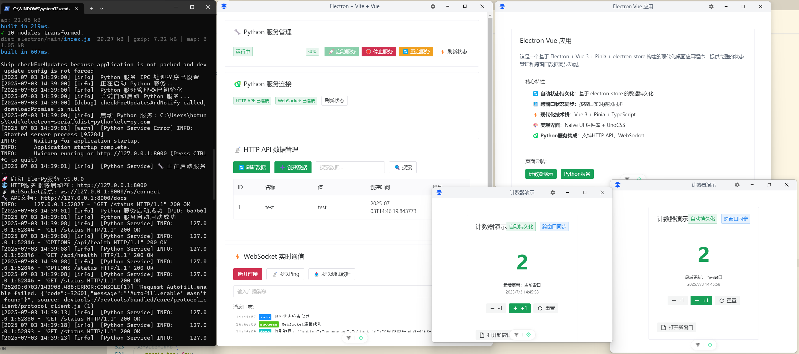

# Electron Vue Vite   应用

一个基于 Electron + Vue 3 + Vite 构建的现代化桌面应用程序框架，专为  应用而设计。



## 📋 项目简介

这是一个现代化的 Electron 桌面应用程序模板，整合了 Vue 3、Vite 和 TypeScript，提供了完整的开发工具链和优雅的用户界面。项目采用最新的前端技术栈，为开发高性能的桌面应用程序提供了坚实的基础。

## ✨ 技术栈

### 核心技术
- **Electron** `v29.4.6` - 跨平台桌面应用程序框架
- **Vue 3** `v3.4.21` - 渐进式 JavaScript 框架
- **Vite** `v5.4.19` - 下一代前端构建工具
- **TypeScript** `v5.8.3` - JavaScript 的超集，提供静态类型检查

### UI 组件库
- **Naive UI** `v2.42.0` - 现代化的 Vue 3 组件库
- **UnoCSS** `v66.3.2` - 原子化 CSS 引擎
- **Iconify** - 丰富的图标库

### 开发工具
- **Vue Router** `v4.5.1` - Vue.js 官方路由管理器
- **VueUse** `v13.4.0` - Vue 组合式 API 工具集
- **Electron Builder** `v24.13.3` - Electron 应用打包工具

## 🚀 功能特性

- ⚡️ **快速开发** - 基于 Vite 的快速热重载
- 🎨 **现代 UI** - 集成 Naive UI 组件库，支持明暗主题切换
- 🔧 **TypeScript 支持** - 完整的类型定义和 提示
- 📦 **自动导入** - 组件和 API 自动导入，提升开发效率
- 🔒 **安全架构** - 遵循 Electron 安全最佳实践
- 🌐 **IPC 通信** - 完整的主进程与渲染进程通信机制
- 🪟 **多窗口支持** - 完整的多窗口管理系统，支持窗口创建、控制和通信
- 📱 **响应式设计** - 支持多种屏幕尺寸
- 🛠️ **开发工具** - 集成 Vue DevTools 和开发者工具

## 📁 目录结构

```
electron-serial/
├── electron/                 # Electron 相关代码
│   ├── main/                # 主进程代码
│   │   └── index.ts        # 主进程入口文件
│   ├── preload/            # 预加载脚本
│   │   └── index.ts        # 预加载脚本入口
│   └── electron-env.d.ts   # Electron 类型定义
├── src/                      # 渲染进程代码 (Vue 应用)
│   ├── components/          # Vue 组件
│   ├── views/              # 页面组件
│   ├── demos/              # 示例代码
│   │   ├── ipc.ts         # IPC 通信示例
│   │   └── node.ts        # Node.js API 示例
│   ├── assets/             # 静态资源
│   ├── App.vue             # 根组件
│   ├── main.ts             # 应用入口
│   ├── route.ts            # 路由配置
│   ├── shims.d.ts          # 前端部分类型定义，包括windows
│   └── style.css           # 全局样式
├── public/                  # 公共资源
├── package.json            # 项目配置
├── vite.config.ts          # Vite 配置
├── tsconfig.json           # TypeScript 配置
└── electron-builder.json5  # 打包配置
```

## 🛠️ 安装与使用

### 环境要求

- Node.js >= 16.0.0
- npm 或 yarn 或 pnpm

### 安装依赖

```bash
npm install
# 或
yarn install
# 或
pnpm install
```

### 开发模式

```bash
npm run dev
```

这将启动 Vite 开发服务器和 Electron 应用程序，支持热重载。

### 构建应用

```bash
npm run build
```

这将构建 Vue 应用并打包 Electron 应用程序。

### 预览构建

```bash
npm run preview
```

预览构建后的应用程序。

## 🔧 核心架构

### 主进程 (electron/main/)
- 负责应用程序生命周期管理
- 创建和管理浏览器窗口
- 处理系统级 API 调用
- 管理应用程序菜单和托盘

### 预加载脚本 (electron/preload/)
- 在渲染进程中安全地暴露 Node.js API
- 提供主进程与渲染进程之间的通信桥梁
- 实现上下文隔离的安全机制

### 渲染进程 (src/)
- 基于 Vue 3 的现代化用户界面
- 响应式设计和组件化架构
- 集成 Naive UI 组件库
- 支持路由导航和状态管理

## 🪟 多窗口支持

项目提供了完整的多窗口管理系统，包括：

### 窗口管理功能
- **创建窗口**: 支持自定义标题、尺寸和路由
- **模态窗口**: 支持创建模态对话框窗口
- **窗口控制**: 聚焦、最小化、关闭等操作
- **窗口列表**: 实时显示所有窗口状态
- **跨窗口通信**: 窗口间消息传递

## 🔌 IPC 通信

项目提供了完整的 IPC (Inter-Process Communication) 通信机制：

```typescript
// 渲染进程发送消息
window.ipcRenderer.send('channel-name', data)

// 渲染进程接收消息
window.ipcRenderer.on('main-process-message', (event, ...args) => {
  console.log('接收到主进程消息:', ...args)
})

// 主进程处理消息
ipcMain.handle('channel-name', async (event, data) => {
  // 处理逻辑
  return result
})
```

## 🎨 UI 主题

项目支持明暗主题切换，基于 Naive UI 提供的主题系统：

```typescript
// 在 App.vue 中配置主题
const theme = ref(lightTheme) // 或 darkTheme
```

## 📝 开发说明

1. **组件开发**: 所有 Vue 组件放在 `src/components/` 目录下
2. **页面开发**: 页面级组件放在 `src/views/` 目录下
3. **样式规范**: 使用 UnoCSS 原子化 CSS 类名
4. **类型安全**: 充分利用 TypeScript 的类型检查
5. **代码规范**: 遵循 ESLint 和 Prettier 配置